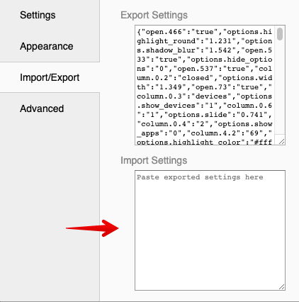
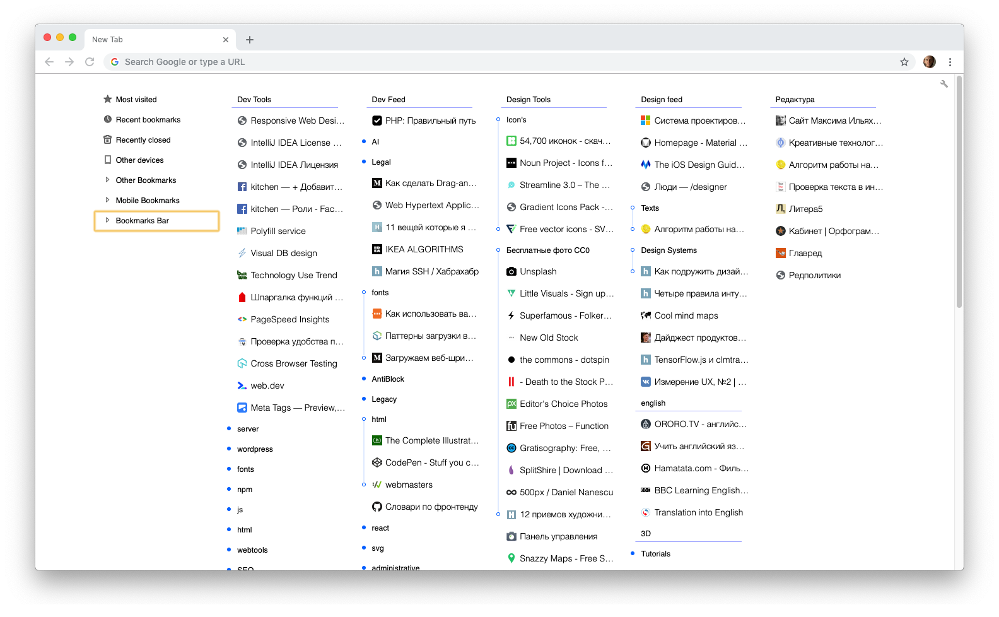

### Light theme for Chrome bookmarks Extension 
# Humble Theme

<a  href="https://chrome.google.com/webstore/detail/mfgdmpfihlmdekaclngibpjhdebndhdj" >Extension in Chrome Store<a>

<a href="https://github.com/quodroc/HumbleNewTabPage">Extension Github<a>

#### How to use
Paste code from <a href="conf.json">conf.json<a> to  extension settings:
 

#### Preview
 

